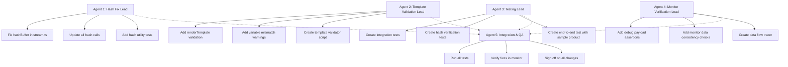

# Multi-Agent Fix and Test Plan

**Objective:** Fix all identified data flow issues and verify fixes with comprehensive testing

---

## Issues to Fix

### P0 (Critical)
1. **Image Hash Inconsistency** - Different hash lengths (16 vs 64 chars) used in different parts of codebase

### P1 (High)
2. **Template Variable Validation** - Add detection for unreplaced template variables
3. **Debug Payload Verification** - Add runtime verification that debugPayload matches actual API calls

---

## Agent Assignment Strategy



---

## Agent 1: Hash Fix Lead

**Focus:** Fix image hash inconsistency (CRITICAL)

### Task 1.1: Unify Hash Function
**File:** `app/app/routes/app-proxy.see-it-now.stream.ts`

**Changes:**
```typescript
// BEFORE (lines 34-35):
function hashBuffer(buffer: Buffer): string {
  return crypto.createHash("sha256").update(buffer).digest("hex").slice(0, 16);
}

// AFTER:
import { computeImageHash } from "~/services/see-it-now/hashing.server";

// Use canonical hash function
function hashBuffer(buffer: Buffer): string {
  return computeImageHash(buffer); // Returns full 64-char hash
}
```

### Task 1.2: Verify All Hash Computations
**Files to check:**
- `app/app/services/see-it-now/extractor.server.ts` - Uses `computeImageHash` ✅
- `app/app/services/see-it-now/composite-runner.server.ts` - Uses `computeImageHash` ✅
- `app/app/routes/app-proxy.see-it-now.stream.ts` - Will use `computeImageHash` after fix

### Task 1.3: Add Hash Utility Tests
**File:** `app/app/tests/unit/hash-consistency.test.ts` (create)

```typescript
describe("Hash Consistency", () => {
  it("should use same hash function everywhere", () => {
    const buffer = Buffer.from("test data");
    const hash1 = computeImageHash(buffer);
    const hash2 = hashBuffer(buffer); // After fix
    expect(hash1).toBe(hash2);
    expect(hash1.length).toBe(64); // Full SHA256
  });
});
```

**Dependencies:** None
**Estimated Time:** 1 hour
**Deliverable:** Working code with unified hash function

---

## Agent 2: Template Validation Lead

**Focus:** Add validation to detect template variable mismatches

### Task 2.1: Add Variable Substitution Validation
**File:** `app/app/services/prompt-control/prompt-resolver.server.ts`

**Changes:**
```typescript
// AFTER renderTemplate function (around line 162)
export function renderTemplate(
  template: string | null,
  variables: Record<string, unknown>
): string | null {
  if (!template) return null;

  const result = template.replace(/\{\{([\w.]+)\}\}/g, (match, path: string) => {
    const value = resolveDotPath(variables, path);
    return value ?? match;
  });

  // VALIDATION: Check for unreplaced variables
  const unreplaced = result.match(/\{\{[\w.]+\}\}/g);
  if (unreplaced) {
    logger.warn(
      { unreplacedVariables: unreplaced },
      `Template has unreplaced variables: ${unreplaced.join(", ")}`
    );
  }

  return result;
}
```

### Task 2.2: Create Template Validation Script
**File:** `app/scripts/validate-templates.ts` (create)

```typescript
// Script to validate all templates in DB match code expectations
// Usage: npx ts-node scripts/validate-templates.ts

async function validateTemplates() {
  // 1. Query all active templates from DB
  // 2. Extract {{variables}} from each template
  // 3. Compare with expected variables from code
  // 4. Report any mismatches
}
```

**Dependencies:** None
**Estimated Time:** 1.5 hours
**Deliverable:** Template validation in code + standalone script

---

## Agent 3: Testing Lead

**Focus:** Create comprehensive tests for data flow

### Task 3.1: Create Integration Tests
**File:** `app/app/tests/integration/data-flow.test.ts` (create)

```typescript
describe("Data Flow Integration", () => {
  it("should maintain prompt consistency through pipeline", async () => {
    // 1. Mock product data
    // 2. Run extractProductFacts
    // 3. Run buildPlacementSet
    // 4. Verify debugPayload.promptText matches what would be sent
  });

  it("should maintain image hash consistency", async () => {
    // 1. Create test image buffer
    // 2. Pass through pipeline
    // 3. Verify all hashes for same image are identical
  });
});
```

### Task 3.2: Create End-to-End Test with Sample Product
**File:** `app/app/tests/e2e/sundar-mirror.test.ts` (create)

Use your sample product: https://www.bhm.com.au/products/detailed-sundar-mirror-bleach-chalky-bleach

```typescript
describe("Detailed Sundar Mirror - End to End", () => {
  const sampleProduct = {
    title: "Detailed Sundar Mirror - Bleach/Chalky Bleach",
    productType: "Mirror",
    tags: ["reclaimed_teak", "mirror", "wall_hanging"],
    // ...
  };

  it("should extract correct material facts", async () => {
    // Verify extracted facts include reclaimed_teak
  });

  it("should generate appropriate placement set", async () => {
    // Verify placement instructions are wall-mounted only
  });

  it("should render all 8 variants", async () => {
    // Verify 8 variants created
  });
});
```

### Task 3.3: Create Hash Verification Test
**File:** `app/app/tests/unit/hash-verification.test.ts` (create)

```typescript
describe("Hash Verification", () => {
  it("all hash functions should produce consistent output", () => {
    const testBuffer = Buffer.from("test image data");
    
    // Test all hash functions produce same result
    const hash1 = computeImageHash(testBuffer);
    const hash2 = hashBuffer(testBuffer);
    
    expect(hash1).toBe(hash2);
    expect(hash1.length).toBe(64);
  });
});
```

**Dependencies:** Agent 1 (hash fix)
**Estimated Time:** 2 hours
**Deliverable:** Comprehensive test suite

---

## Agent 4: Monitor Verification Lead

**Focus:** Add runtime verification that monitor shows correct data

### Task 4.1: Add Debug Payload Assertions
**File:** `app/app/services/prompt-control/llm-call-tracker.server.ts`

Add before saving to DB:
```typescript
// Validate debugPayload before saving
function validateDebugPayload(payload: DebugPayload): void {
  // Ensure promptText is not empty
  // Ensure model is specified
  // Ensure images have correct structure
  // Log any issues
}
```

### Task 4.2: Create Data Flow Tracer
**File:** `app/app/services/telemetry/data-flow-tracer.server.ts` (create)

```typescript
// Traces a request through the entire pipeline
// Records: input -> stage 1 -> stage 2 -> stage 3 -> output
// Verifies consistency at each step

export async function traceDataFlow(traceId: string): Promise<FlowTrace> {
  // 1. Fetch all events for traceId
  // 2. Verify data consistency between stages
  // 3. Report any mismatches
}
```

### Task 4.3: Add Monitor Consistency Checks
**File:** `app/app/services/monitor/verify-run.server.ts` (create)

```typescript
// Verifies a run's data is consistent
export async function verifyRunConsistency(runId: string): Promise<{
  isValid: boolean;
  issues: string[];
}> {
  // 1. Check LLM calls have valid debugPayloads
  // 2. Verify variant images match stored hashes
  // 3. Verify facts snapshot matches placement set
  // 4. Return any issues found
}
```

**Dependencies:** Agent 1 (hash fix)
**Estimated Time:** 1.5 hours
**Deliverable:** Runtime verification tools

---

## Agent 5: Integration & QA

**Focus:** Coordinate all agents and perform final verification

### Task 5.1: Coordinate Agent Work
- Monitor progress of Agents 1-4
- Resolve any conflicts
- Ensure all tests pass

### Task 5.2: Run Full Test Suite
```bash
# All agents should verify their changes pass:
cd app
npm test
npm run test:integration
```

### Task 5.3: Verify Fixes in Monitor
1. Run a test render with sample product
2. Check monitor displays:
   - Correct prompt text in LLM calls
   - Consistent image hashes
   - Accurate debugPayloads

### Task 5.4: Create Summary Report
Document:
- What was fixed
- Test results
- Any remaining issues

**Dependencies:** All other agents complete
**Estimated Time:** 1 hour
**Deliverable:** QA sign-off

---

## Execution Order

```
Phase 1 (Parallel):
├── Agent 1: Start hash fix
├── Agent 2: Start template validation
└── Agent 3: Start test creation

Phase 2 (After Agent 1 completes):
├── Agent 4: Start monitor verification (needs hash fix)
└── Agent 3: Complete hash verification tests

Phase 3 (Final):
└── Agent 5: Integration & QA
```

---

## Testing Checklist

After all fixes, verify:

- [ ] Image hashes are consistent (64 chars) throughout system
- [ ] Unreplaced template variables are logged as warnings
- [ ] debugPayload.promptText matches actual API call
- [ ] debugPayload.images[].hash matches stored image hash
- [ ] Monitor displays correct data for sample product
- [ ] All integration tests pass
- [ ] End-to-end test with Sundar Mirror passes

---

## Rollback Plan

If issues arise:
1. Revert hash fix (restore slice(0, 16))
2. Disable template validation warnings
3. Roll back to previous commit

---

## Success Criteria

1. ✅ All image hashes use consistent 64-character format
2. ✅ Template variable mismatches are detected and logged
3. ✅ Tests verify data consistency through entire pipeline
4. ✅ Monitor accurately reflects what was sent to model
5. ✅ Sample product renders correctly with accurate data
