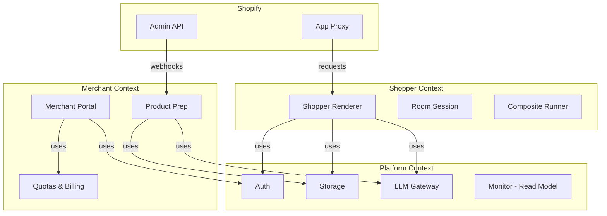

# See It - Rebuild Architecture

> **Thesis:** This app suffers from "demo drift" - each feature was bolted on incrementally without architectural guardrails. The result is 47 audit issues, duplicate logic, and security holes.

## Core Domain (What This App Actually Does)

```
┌─────────────────────────────────────────────────────────────────┐
│                         SHOPPER VIEW                            │
│  ┌──────────────┐    ┌──────────────┐    ┌──────────────────┐  │
│  │ Upload Room  │───▶│ Select       │───▶│ See Product in   │  │
│  │ Photo        │    │ Product      │    │ Their Room       │  │
│  └──────────────┘    └──────────────┘    └──────────────────┘  │
└─────────────────────────────────────────────────────────────────┘
                            │
                            ▼
┌─────────────────────────────────────────────────────────────────┐
│                    MERCHANT ADMIN VIEW                          │
│  ┌──────────────┐    ┌──────────────┐    ┌──────────────────┐  │
│  │ Product      │───▶│ Prepare      │───▶│ Monitor Usage &  │  │
│  │ Catalog      │    │ Images       │    │ Quotas           │  │
│  └──────────────┘    └──────────────┘    └──────────────────┘  │
└─────────────────────────────────────────────────────────────────┘
```

**Two distinct workflows:**
1. **Shopper Flow:** Upload room → AI composes product into room → Returns rendered image
2. **Merchant Flow:** Select products → Background removal + AI prep → Store prepared assets

---

## The 7 Deadly Sins (Why This App Sucks)

| Sin | Current State | Rebuild Approach |
|-----|---------------|------------------|
| **1. Security Swiss Cheese** | Unauthenticated diagnostic endpoint, hardcoded secrets, tenant isolation gaps | Zero-trust auth, capability-based access, secrets via infra only |
| **2. Service Spaghetti** | 15+ service modules with unclear boundaries | 3 bounded contexts: `Shopper`, `Merchant`, `Platform` |
| **3. Database as Integration** | App and monitor share schema but have drift | Single source of truth per context, explicit APIs for cross-context |
| **4. Prompt Control Over-Engineering** | Versioning, A/B testing, audit logs for prompts no one asked for | Delete it. Start with env vars. Add complexity only when needed. |
| **5. Monitor as Second-Class Citizen** | Separate service that copies logic poorly | Monitor is a read model, same deploy unit, separate API surface |
| **6. Background Job Hell** | Cron polling, intervals, race conditions | Queue-based workers with idempotency keys |
| **7. Config Explosion** | 50+ env vars, multiple .env files | 12-Factor config: env vars only, validated at boot |

---

## New Architecture: 3 Bounded Contexts



### Context 1: Shopper (The "See It" Experience)

**Responsibility:** Everything the end customer sees on the storefront.

**Routes:**
- `POST /see-it/rooms` - Create room session
- `POST /see-it/rooms/:id/products/:id/render` - Render product in room
- `GET /see-it/rooms/:id/results/:id` - Get result

**Key Design Decision:** Stateless rendering. Each request is independent. No session affinity.

```typescript
// Core Types
interface RenderRequest {
  roomImage: Buffer;          // Raw upload (temporary, processed then discarded)
  productAssetId: string;     // Reference to prepared product
  placement: PlacementHint;   // Optional merchant override
}

interface RenderResult {
  imageUrl: string;           // Signed URL, 24hr expiry
  metadata: {
    model: string;
    promptVersion: string;
    latencyMs: number;
  }
}
```

**Why this is better:**
- Current: Complex session management, state machines, polling
- New: Request/response with async option (webhook or polling endpoint)

### Context 2: Merchant (The Admin Experience)

**Responsibility:** Product preparation, quota management, settings.

**Routes:**
- `GET /api/products` - List with prep status
- `POST /api/products/:id/prepare` - Trigger background prep
- `GET /api/quota` - Current usage

**Key Design Decision:** Prep is a background job, status tracked explicitly.

```typescript
interface PrepJob {
  id: string;
  productAssetId: string;
  status: 'pending' | 'processing' | 'completed' | 'failed';
  operations: PrepOperation[];
  createdAt: Date;
  completedAt?: Date;
}

type PrepOperation = 
  | { type: 'download-source' }
  | { type: 'remove-background'; provider: 'photoroom' }
  | { type: 'extract-facts'; provider: 'gemini' }
  | { type: 'generate-placement'; provider: 'gemini' }
  | { type: 'upload-assets' }
```

**Why this is better:**
- Current: Implicit state transitions, polling-based processor
- New: Explicit job queue (SQS/SQS-like), idempotent operations

### Context 3: Platform (Shared Infrastructure)

**Responsibility:** Auth, storage, LLM routing, observability.

**Key Design Decision:** Platform exposes interfaces, contexts consume them.

```typescript
// platform/storage.ts
interface Storage {
  upload(key: string, data: Buffer, options: UploadOptions): Promise<void>;
  getSignedUrl(key: string, expiresIn: number): Promise<string>;
  delete(key: string): Promise<void>;
}

// platform/llm.ts  
interface LLMGateway {
  complete(request: CompletionRequest): Promise<CompletionResponse>;
  // No prompt management here - that's domain logic
}

// platform/auth.ts
interface Auth {
  verifyShopifySession(request: Request): Promise<ShopifySession>;
  verifyShopperToken(request: Request): Promise<ShopperSession>;
  verifyApiKey(request: Request): Promise<ApiClient>;
}
```

---

## Database: One Schema, Clear Ownership

```prisma
// Context: Shopper
model RoomSession {
  id        String   @id @default(uuid())
  shopId    String
  imageKey  String   // GCS path
  createdAt DateTime @default(now())
  expiresAt DateTime // TTL
  
  renders Render[]
  @@index([shopId, createdAt])
}

model Render {
  id        String   @id @default(uuid())
  roomId    String
  assetId   String
  status    String   // pending | completed | failed
  resultKey String?  // GCS path to result
  latencyMs Int?
  createdAt DateTime @default(now())
  
  @@index([roomId, status])
}

// Context: Merchant  
model ProductAsset {
  id          String @id @default(uuid())
  shopId      String
  productId   String
  variantId   String?
  sourceUrl   String
  preparedKey String? // GCS path
  
  // Pipeline state (simplified)
  prepStatus  String   // unprepared | queued | processing | ready | failed
  prepJobId   String?  // Reference to job queue
  
  // Extracted data (JSONB for flexibility)
  extractedFacts Json?
  placementSet   Json?
  
  createdAt DateTime @default(now())
  updatedAt DateTime @updatedAt
  
  @@unique([shopId, productId, variantId])
  @@index([shopId, prepStatus])
}

model PrepJob {
  id        String   @id @default(uuid())
  assetId   String
  status    String   // pending | processing | completed | failed
  operations Json[]  // Audit trail
  error     String?
  createdAt DateTime @default(now())
  updatedAt DateTime @updatedAt
  
  @@index([status, createdAt]) // For worker polling
}

// Context: Platform
model Shop {
  id           String   @id @default(uuid())
  domain       String   @unique
  accessToken  String   // Encrypted
  plan         String   // free | pro | enterprise
  quotaDaily   Int      
  quotaMonthly Int
  createdAt    DateTime @default(now())
  
  usageDaily   UsageDaily[]
}

model UsageDaily {
  id     String @id @default(uuid())
  shopId String
  date   DateTime @db.Date
  renders Int     @default(0)
  prepOps Int     @default(0)
  
  @@unique([shopId, date])
}

// Monitor (read model, populated by events)
model MonitorEvent {
  id        String   @id @default(uuid())
  shopId    String
  type      String   // render | prep
  status    String   // success | failure
  latencyMs Int?
  metadata  Json?
  createdAt DateTime @default(now())
  
  @@index([shopId, type, createdAt])
}
```

**What's gone:**
- Prompt control plane (versions, audit logs, runtime config)
- Complex session table (Shopify handles this)
- Saved rooms (YAGNI - add when requested)
- Composite runs (merged into Render)

---

## Worker Architecture (Replace Cron Polling)

```typescript
// Current: setInterval processor with race conditions
// New: Queue-based workers

interface PrepWorker {
  // Single responsibility: process one job
  async process(job: PrepJob): Promise<void> {
    const asset = await db.productAsset.findById(job.assetId);
    
    for (const op of job.operations) {
      await this.executeOp(op, asset);
      await job.updateProgress(op);
    }
    
    await asset.markReady();
  }
  
  // Idempotent operations
  private async executeOp(op: PrepOperation, asset: ProductAsset) {
    // Each operation checks "has this already been done?"
    // If yes: return cached result
    // If no: do work, store result, return
  }
}

// Deployment: Same app, separate worker process
// railway worker: node --worker src/workers/prep.ts
```

**Why this is better:**
- Current: One processor for all shops, can get stuck, no visibility
- New: Per-job processing, dead letter queue, exponential backoff per job

---

## Prompt Strategy (The Big Delete)

**Current:** Versioned prompts, audit logs, runtime overrides, A/B framework.

**New:**

```typescript
// config/prompts.ts
// These are code, not data. Change = deploy.

export const PRODUCT_FACTS_PROMPT = `
You are analyzing a furniture product...
// ... prompt text
` as const;

export const PLACEMENT_PROMPT = `
You are placing a product in a room...
// ... prompt text  
` as const;

// If we need shop-specific overrides later:
interface PromptOverrides {
  shopId: string;
  promptName: string;
  override: string;
  // No versioning - latest wins, deploy to revert
}
```

**Deletion rationale:**
- Prompt A/B testing was never used
- Audit logs were never queried
- Version rollback never happened
- Complexity cost > flexibility benefit

**When to add back:**
- If non-technical users need to edit prompts → Add CMS
- If you need gradual rollouts → Add feature flags (LaunchDarkly/etc)

---

## Authentication (Zero Trust)

```typescript
// All routes require explicit auth

// Admin routes
export async function loader({ request }: LoaderArgs) {
  const session = await auth.requireShopifyAdmin(request);
  // Now you have shopId, can query shop-specific data
}

// App proxy routes (shopper-facing)
export async function loader({ request }: LoaderArgs) {
  const session = await auth.requireShopperToken(request);
  // Token is JWT signed with SHOPPER_TOKEN_SECRET
  // Contains shopId, expires in 24hr
}

// External API
export async function loader({ request }: LoaderArgs) {
  const client = await auth.requireApiKey(request);
  // API key maps to shop, rate limited per key
}

// No implicit auth. No bypass env vars. No fallbacks.
```

---

## Deployment: Single Unit

```yaml
# railway.yaml
services:
  web:
    build: .
    start: npm run start
    
  worker-prep:
    build: .
    start: npm run worker:prep
    
  worker-render:
    build: .
    start: npm run worker:render
```

**Why:**
- Current: App + Monitor as separate services with shared schema nightmares
- New: One codebase, multiple processes, same schema

---

## Migration Strategy (If Keeping Current DB)

**Phase 1: Freeze Features**
- No new features until rebuild stabilizes
- Fix P0 security issues only

**Phase 2: Strangler Fig Pattern**
```
Route traffic based on feature flags:
- Old product prep → Current processor
- New product prep → New worker (behind flag)
- Gradually migrate shops
```

**Phase 3: Data Migration**
- Prompt versions → Archive table, stop using
- Composite runs → Migrate to Render model
- Sessions → Let expire naturally

**Phase 4: Cleanup**
- Delete deprecated tables
- Remove dead code

---

## File Structure (Flat is Better Than Nested)

```
src/
├── contexts/
│   ├── shopper/
│   │   ├── routes.ts          # Route handlers
│   │   ├── room-session.ts    # Domain logic
│   │   ├── renderer.ts        # AI composition
│   │   └── types.ts
│   ├── merchant/
│   │   ├── routes.ts
│   │   ├── prep-job.ts        # Background job logic
│   │   ├── product-asset.ts   # Domain logic
│   │   └── types.ts
│   └── platform/
│       ├── auth.ts
│       ├── storage.ts
│       ├── llm.ts
│       ├── quota.ts
│       └── db.ts
├── workers/
│   ├── prep.ts
│   └── render.ts
├── config/
│   ├── prompts.ts
│   └── models.ts
└── index.ts
```

**No:**
- `services/` folder (vague boundaries)
- `utils/` folder (dumping ground)
- `lib/` folder (more dumping)
- Deep nesting (hard to navigate)

---

## Success Metrics

| Metric | Current | Target |
|--------|---------|--------|
| Service modules | 15+ | 7 (3 contexts + 4 platform) |
| Env vars | 50+ | 12 |
| Database tables | 20+ | 8 |
| Security issues | 4 P0 | 0 |
| Lines of code | ~15K | ~5K |
| Deploy time | ? | <2 min |
| Local dev | Broken | One command |

---

## The Verdict

**Don't fix this codebase. Rebuild it.**

The audit found 47 issues. Fixing them individually will take longer than a clean rebuild, and you'll still have the architectural debt.

**Estimated rebuild time:** 2-3 weeks for a solo dev with clear scope.

**What to keep:**
- Database connection patterns
- GCS storage logic  
- PhotoRoom/Gemini integrations (the actual API calls)
- Shopify auth patterns (but simplify)

**What to delete:**
- Prompt control plane
- Monitor as separate service
- Complex session state machines
- Cron-based processor
- 80% of the routes (many are unused)
